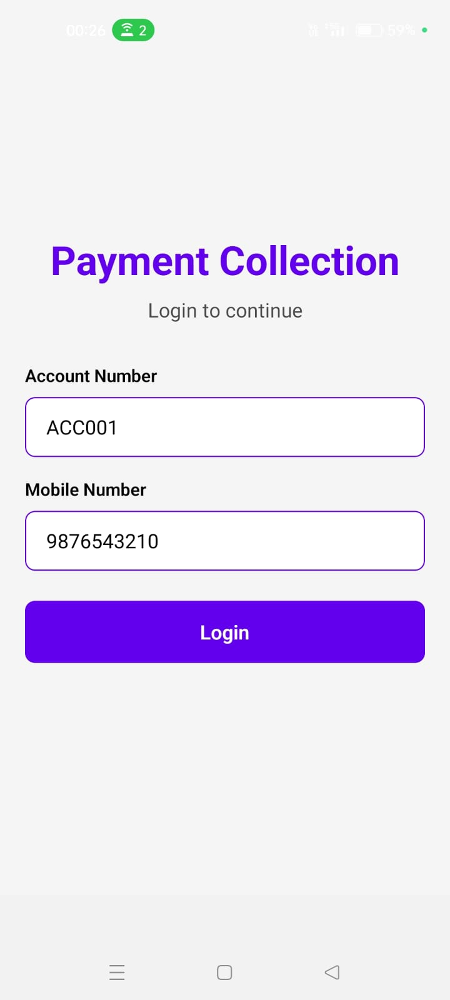
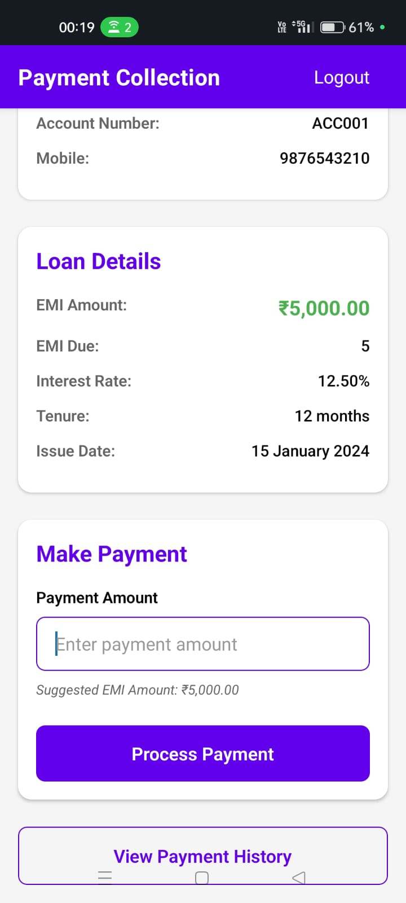
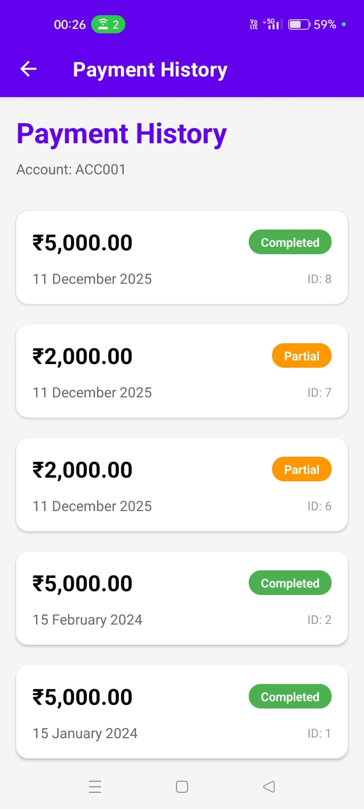

# Payment Collection App

A complete Payment Collection Application built with React Native (Expo) for the frontend, Node.js + Express for the backend, and MySQL for the database.

## 📸 App Screenshots

### **Login Screen**


### **Payment Screen**


### **Payment History**


## Features

- **Login Screen**: Authenticate using account number and mobile number
- **Payment Screen**: View loan details and process payments
- **Payment History**: View all payment transactions for an account
- **Input Validation**: Comprehensive form validation
- **Error Handling**: Proper error handling throughout the application
- **Global State Management**: Context API for user authentication state
- **Responsive Design**: Clean and modern UI

## Tech Stack

### Frontend
- React Native (Expo)
- React Navigation
- React Native Paper (UI components)
- Axios (HTTP client)
- Context API (State management)

### Backend
- Node.js
- Express.js
- MySQL2
- CORS
- dotenv

### Database
- MySQL

## Project Structure

```
.
├── backend/
│   ├── config/
│   │   └── database.js          # MySQL connection configuration
│   ├── routes/
│   │   ├── customers.js         # Customer API routes
│   │   └── payments.js          # Payment API routes
│   ├── .env                     # Environment variables
│   ├── .env.example             # Environment variables template
│   ├── server.js                # Express server entry point
│   └── package.json             # Backend dependencies
│
├── frontend/
│   ├── components/
│   │   ├── Button.js            # Reusable button component
│   │   ├── Card.js              # Reusable card component
│   │   └── Input.js             # Reusable input component
│   ├── context/
│   │   └── AuthContext.js       # Authentication context
│   ├── screens/
│   │   ├── LoginScreen.js       # Login screen
│   │   ├── PaymentScreen.js     # Payment screen
│   │   └── PaymentHistoryScreen.js # Payment history screen
│   ├── services/
│   │   └── api.js               # API service layer
│   ├── utils/
│   │   └── validation.js        # Validation utilities
│   ├── .env                     # Environment variables
│   ├── .env.example             # Environment variables template
│   ├── App.js                   # Main app component
│   ├── app.json                 # Expo configuration
│   ├── babel.config.js          # Babel configuration
│   └── package.json             # Frontend dependencies
│
├── database/
│   └── schema.sql               # MySQL database schema
│
└── README.md                    # This file
```

## Setup Instructions

### Prerequisites

- Node.js (v14 or higher)
- MySQL (v5.7 or higher)
- npm or yarn
- Expo CLI (for running React Native app)

### Database Setup

1. **Install MySQL** (if not already installed)
   - Download and install MySQL from [mysql.com](https://www.mysql.com/downloads/)

2. **Create Database**
   ```bash
   mysql -u root -p
   ```
   Then run:
   ```sql
   source database/schema.sql
   ```
   Or manually execute the SQL file:
   ```bash
   mysql -u root -p < database/schema.sql
   ```

3. **Verify Tables**
   ```sql
   USE payment_collection;
   SHOW TABLES;
   SELECT * FROM Customers;
   SELECT * FROM Payments;
   ```

### Backend Setup

1. **Navigate to backend directory**
   ```bash
   cd backend
   ```

2. **Install dependencies**
   ```bash
   npm install
   ```

3. **Configure environment variables**
   - Copy `.env.example` to `.env` (if not already done)
   - Update `.env` with your MySQL credentials:
     ```env
     PORT=3000
     DB_HOST=localhost
     DB_USER=root
     DB_PASSWORD=your_mysql_password
     DB_NAME=payment_collection
     DB_PORT=3306
     ```

4. **Start the server**
   ```bash
   npm start
   ```
   Or for development with auto-reload:
   ```bash
   npm run dev
   ```

   The server will start on `http://localhost:3000`

5. **Test the API**
   ```bash
   curl http://localhost:3000/health
   ```

### Frontend Setup

1. **Navigate to frontend directory**
   ```bash
   cd frontend
   ```

2. **Install dependencies**
   ```bash
   npm install
   ```

3. **Configure API URL**
   - Open `frontend/config/api.js`
   - Update `API_BASE_URL` based on your environment:
     ```javascript
     // For Android Emulator:
     export const API_BASE_URL = 'http://10.0.2.2:3000';
     
     // For iOS Simulator:
     export const API_BASE_URL = 'http://localhost:3000';
     
     // For Physical Device (replace with your computer's IP):
     export const API_BASE_URL = 'http://192.168.1.100:3000';
     ```
   
   **Note**: For physical device, find your computer's IP address:
   - Windows: Run `ipconfig` in Command Prompt (look for IPv4 Address)
   - Mac/Linux: Run `ifconfig` or `ip addr` in Terminal

4. **Start the Expo development server**
   ```bash
   npm start
   ```
   Or:
   ```bash
   expo start
   ```

5. **Run on device/emulator**
   - Press `a` for Android emulator
   - Press `i` for iOS simulator
   - Scan QR code with Expo Go app on your physical device

## API Endpoints

### Customer Endpoints

#### POST /customers/login
Authenticate a customer using account number and mobile number.

**Request Body:**
```json
{
  "account_number": "ACC001",
  "mobile": "9876543210"
}
```

**Response:**
```json
{
  "success": true,
  "message": "Login successful",
  "data": {
    "account_number": "ACC001",
    "name": "John Doe",
    "mobile": "9876543210",
    "emi_due": 5,
    "emi_amount": 5000.00,
    "interest_rate": 12.5,
    "issue_date": "2024-01-15",
    "tenure": 12
  }
}
```

#### GET /customers/:accountNumber
Get customer details by account number.

**Response:**
```json
{
  "success": true,
  "data": {
    "account_number": "ACC001",
    "name": "John Doe",
    "mobile": "9876543210",
    "emi_due": 5,
    "emi_amount": 5000.00,
    "interest_rate": 12.5,
    "issue_date": "2024-01-15",
    "tenure": 12
  }
}
```

### Payment Endpoints

#### POST /payments
Create a new payment record.

**Request Body:**
```json
{
  "customer_account_number": "ACC001",
  "amount": 5000.00
}
```

**Response:**
```json
{
  "success": true,
  "message": "Payment recorded successfully",
  "data": {
    "id": 1,
    "customer_account_number": "ACC001",
    "amount": 5000.00,
    "payment_date": "2024-03-15",
    "status": "completed"
  }
}
```

#### GET /payments/:accountNumber
Get payment history for a customer.

**Response:**
```json
{
  "success": true,
  "data": [
    {
      "id": 1,
      "customer_account_number": "ACC001",
      "amount": 5000.00,
      "payment_date": "2024-03-15",
      "status": "completed"
    }
  ]
}
```

## Database Schema

### Customers Table
- `account_number` (VARCHAR, PRIMARY KEY)
- `name` (VARCHAR)
- `mobile` (VARCHAR)
- `emi_due` (INT)
- `emi_amount` (DECIMAL)
- `interest_rate` (DECIMAL)
- `issue_date` (DATE)
- `tenure` (INT)
- `created_at` (TIMESTAMP)
- `updated_at` (TIMESTAMP)

### Payments Table
- `id` (INT, AUTO_INCREMENT, PRIMARY KEY)
- `customer_account_number` (VARCHAR, FOREIGN KEY)
- `amount` (DECIMAL)
- `payment_date` (DATE)
- `status` (ENUM: 'pending', 'completed', 'partial', 'failed')
- `created_at` (TIMESTAMP)

## Sample Test Data

The schema includes sample data:
- **Account ACC001**: John Doe, Mobile: 9876543210
- **Account ACC002**: Jane Smith, Mobile: 9876543211
- **Account ACC003**: Bob Johnson, Mobile: 9876543212

## Usage

1. **Login**: Enter account number and mobile number
2. **View Loan Details**: After login, see all loan information
3. **Make Payment**: Enter payment amount and confirm
4. **View History**: Navigate to Payment History to see all transactions

## Troubleshooting

### Backend Issues

1. **Database Connection Error**
   - Verify MySQL is running
   - Check `.env` credentials
   - Ensure database exists

2. **Port Already in Use**
   - Change PORT in `.env`
   - Or kill the process using the port

### Frontend Issues

1. **Cannot Connect to Backend**
   - Verify backend is running
   - Check `API_BASE_URL` in `.env`
   - For physical device, use computer's IP address
   - Ensure firewall allows connections

2. **Expo Start Issues**
   - Clear cache: `expo start -c`
   - Reinstall dependencies: `rm -rf node_modules && npm install`

## Development

### Running in Development Mode

**Backend:**
```bash
cd backend
npm run dev
```

**Frontend:**
```bash
cd frontend
npm start
```

